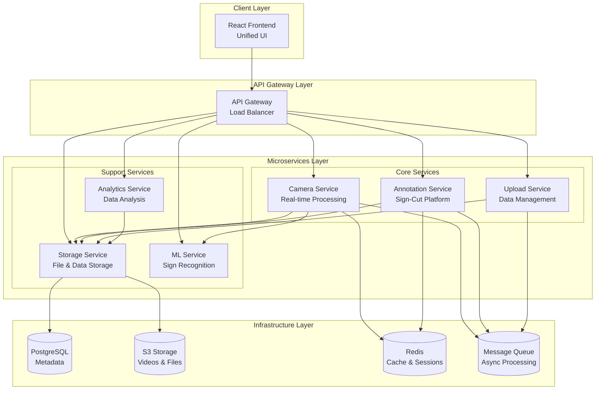
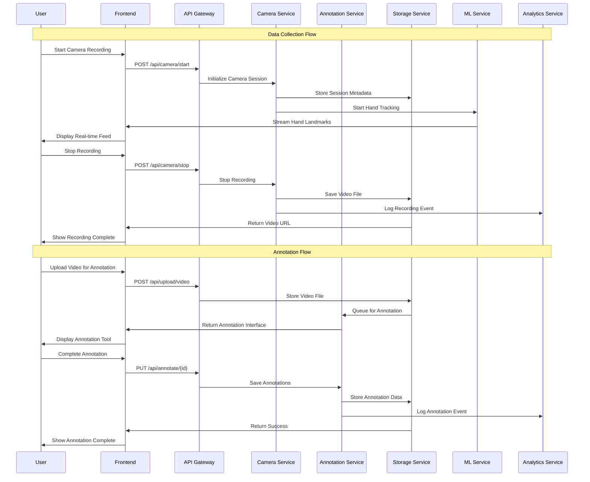
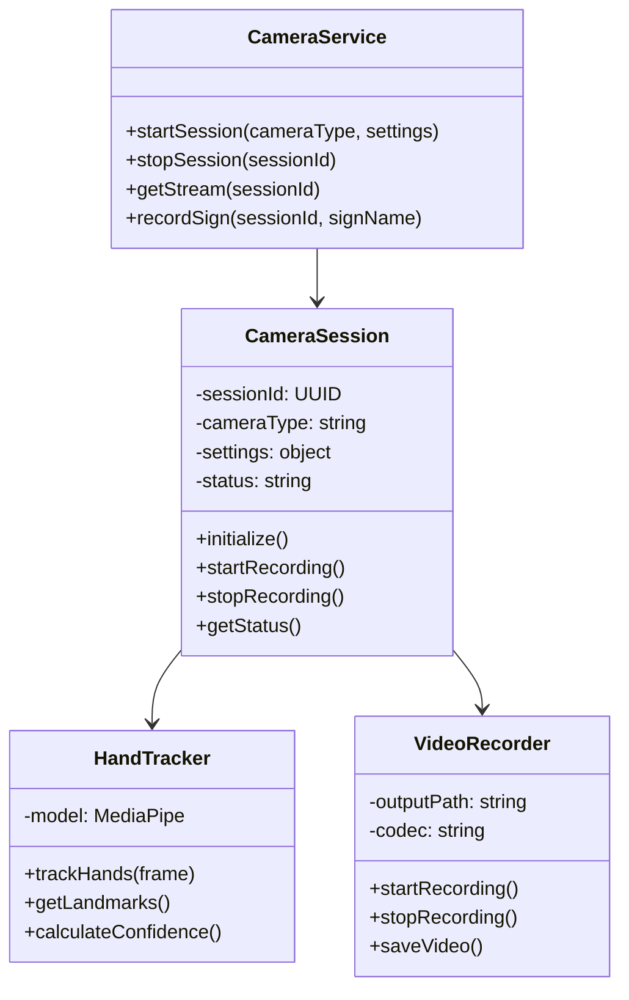
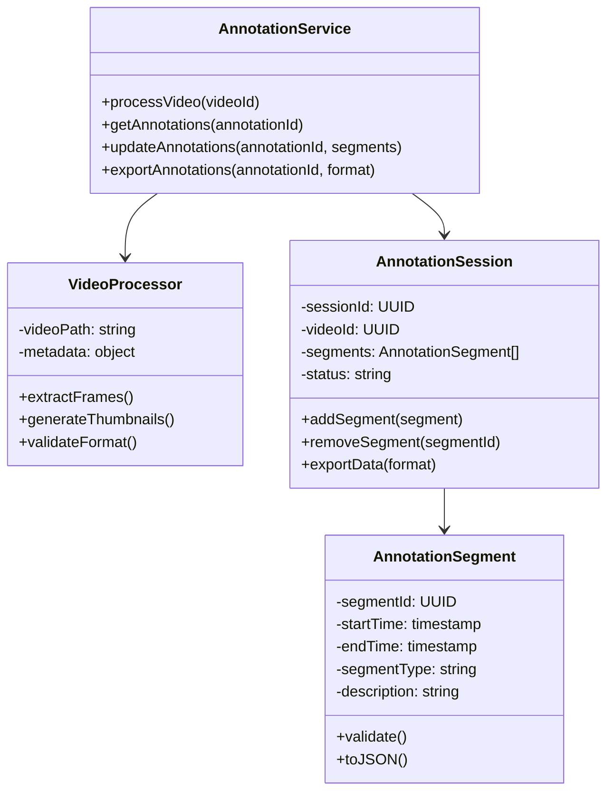
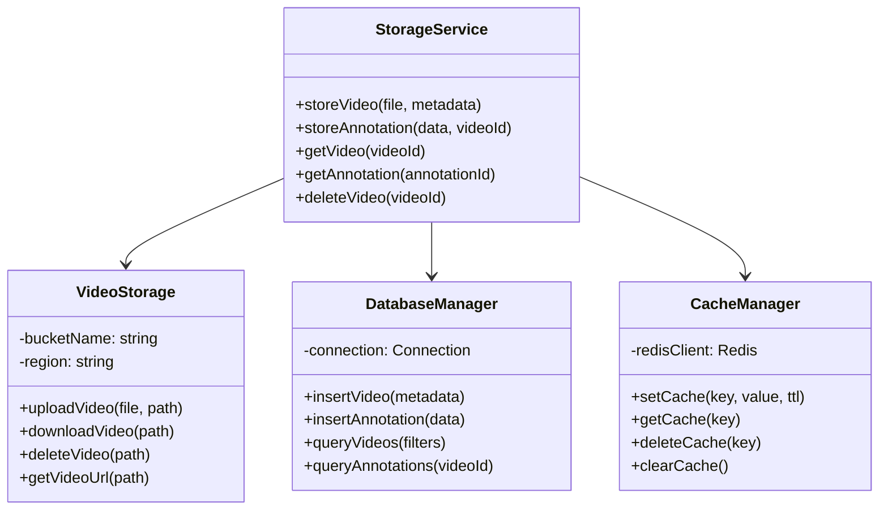
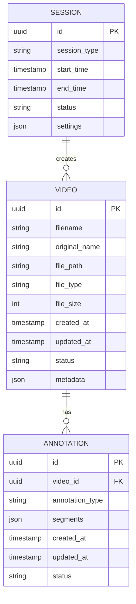
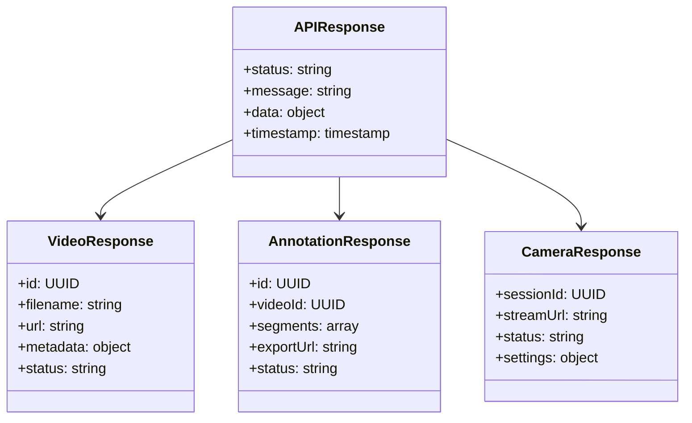
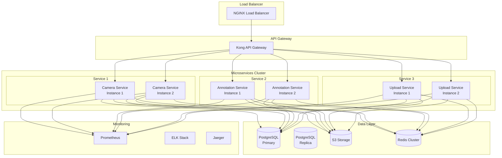
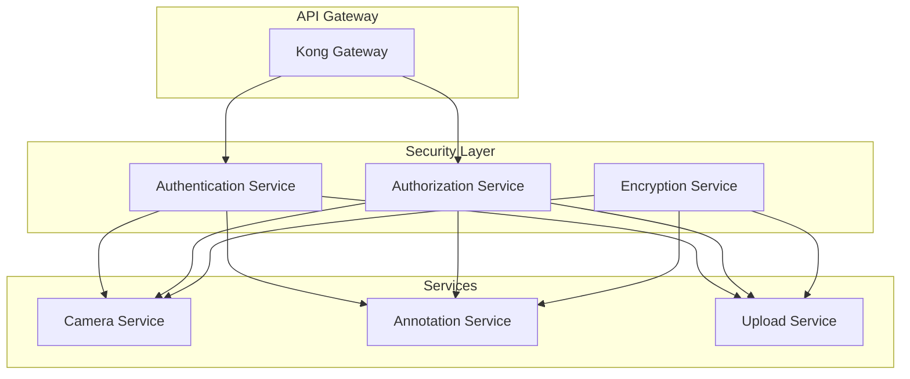

# SpokHand SLR Microservices Architecture - UML Documentation

## 1. System Overview (High-Level Architecture)

## 2. Service Interaction Sequence Diagram

## 3. Service Class Diagrams

### 3.1 Camera Service

### 3.2 Annotation Service

### 3.3 Storage Service

## 4. Data Models

### 4.1 Video Entity

### 4.2 API Response Models

## 5. Deployment Architecture

## 6. Technology Stack

| Layer | Technology | Purpose |
|-------|------------|---------|
| Frontend | React + TypeScript | Unified UI |
| API Gateway | Kong/NGINX | Load balancing, routing |
| Services | Node.js/Python | Microservices |
| Database | PostgreSQL | Metadata storage |
| Cache | Redis | Session management |
| Storage | AWS S3 | File storage |
| Message Queue | RabbitMQ/Kafka | Async processing |
| Monitoring | Prometheus + Grafana | Metrics |
| Logging | ELK Stack | Log management |
| Tracing | Jaeger | Distributed tracing |

## 7. Security Architecture

This architecture provides:
- ✅ Independent scaling of services
- ✅ Fault isolation
- ✅ Technology flexibility
- ✅ Easy maintenance and updates
- ✅ Clear separation of concerns
- ✅ Scalable data processing
- ✅ Real-time capabilities
- ✅ Comprehensive monitoring 