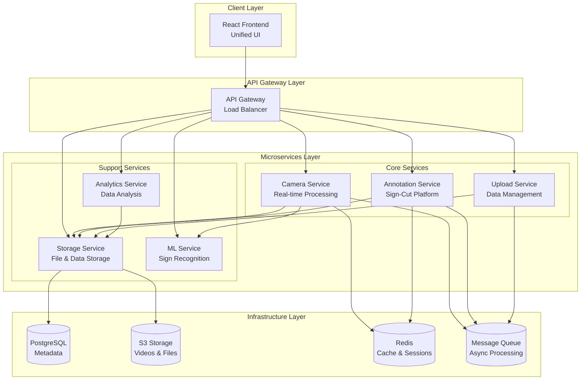
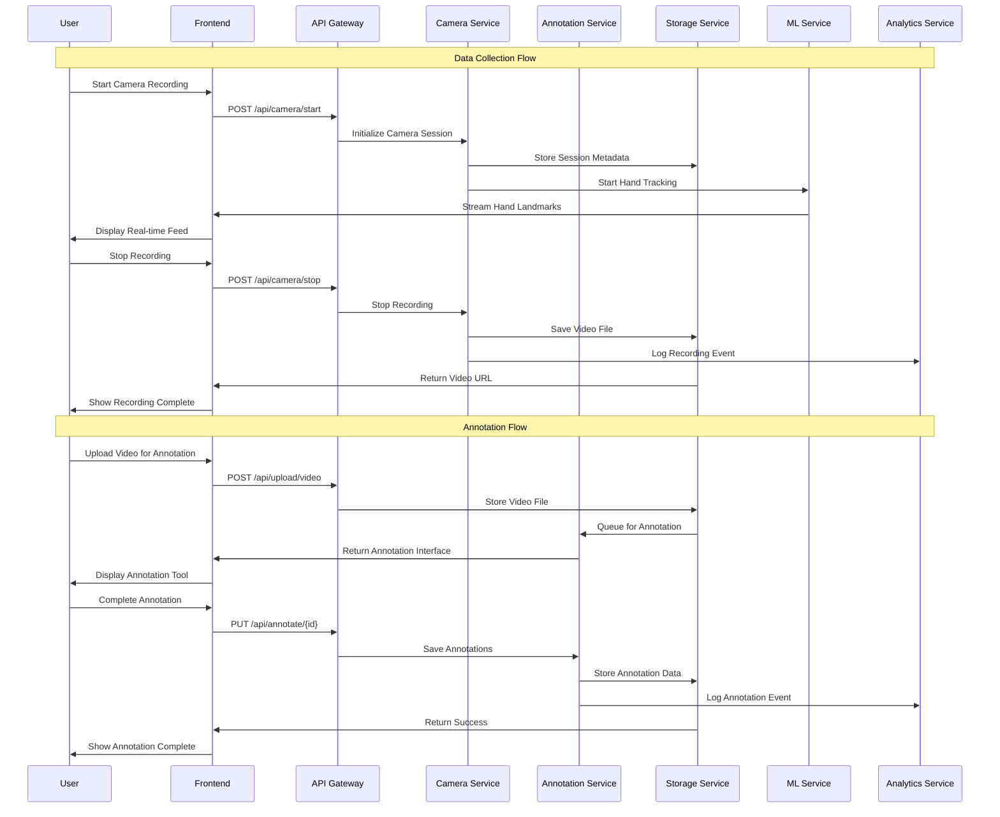
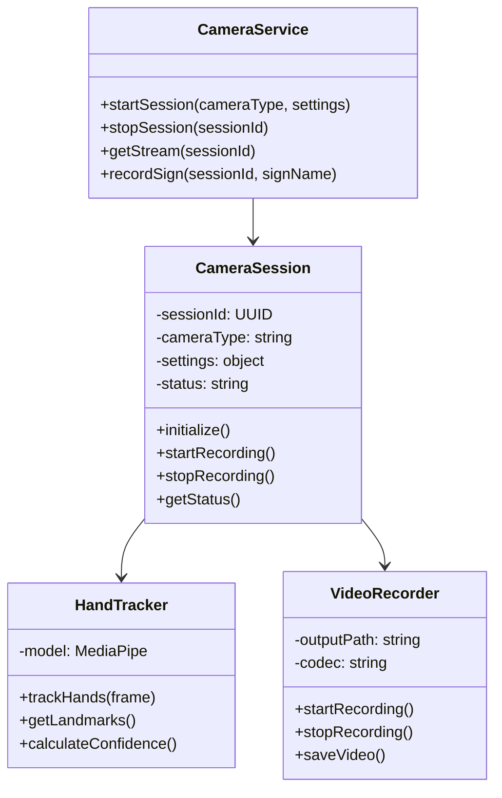
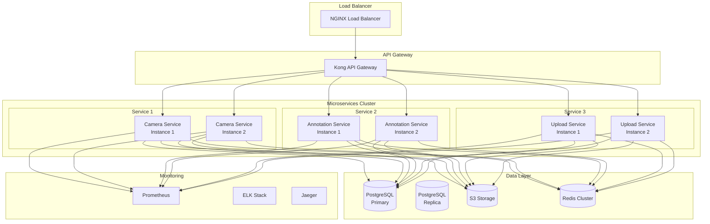
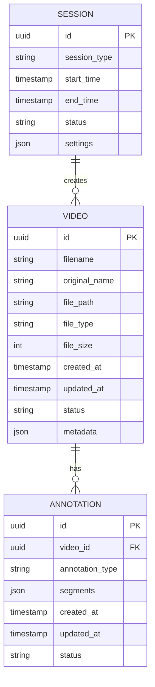

# Clean Mermaid Diagrams for Live Editor

## 1. System Overview
Copy this code to https://mermaid.live/



## 2. Sequence Diagram
Copy this code to https://mermaid.live/



## 3. Camera Service Class Diagram
Copy this code to https://mermaid.live/



## 4. Deployment Architecture
Copy this code to https://mermaid.live/



## 5. Data Models
Copy this code to https://mermaid.live/



## Instructions for Mermaid Live Editor:

1. Go to https://mermaid.live/
2. Clear the editor
3. Copy ONE diagram at a time from above
4. Paste into the editor
5. The diagram should render automatically
6. Use the export button to save as PNG/SVG
7. Repeat for each diagram you need

## Common Issues and Solutions:

- **If you get syntax errors**: Make sure you're copying the code between the ```mermaid and ``` markers
- **If diagram doesn't render**: Try refreshing the page and pasting again
- **If text is too small**: Use the zoom controls in the editor
- **If you need different colors**: Use the theme selector in the editor

## Export Settings for Jira:

- **Format**: PNG (recommended for Jira)
- **Scale**: 1.5x or 2x for better quality
- **Background**: White (works best in Jira)
- **Theme**: Default (clean and professional) 